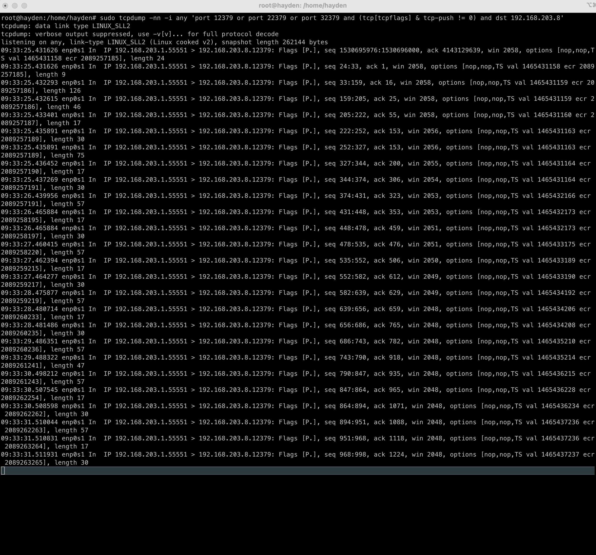

# etcd client 동작 테스트 (with pick first , round robin)

## 개요

kube-apiserver 가 wrapping 해서 사용중인 etcd v3 client 의 기본적인 클라이언트 사이드 로드밸런싱 정책이 round_robin 이기 때문에 kube-apsierver 가 바라보는 etcd 서버들에게 돌아가면서 요청을 전달합니다. (https://github.com/etcd-io/etcd/blob/e7b3bb6ccac840770f108ef9a0f013fa51b83256/client/v3/internal/resolver/resolver.go#L43 )

이러한 로드밸런싱 정책은 etcd 또한 grpc-go 에서 구현된 것을 사용하고 있고. 관련한 문서는 (https://github.com/grpc/grpc-go/blob/master/examples/features/load_balancing/README.md ) 여기서 찾아 볼 수 있습니다. Default 옵션은 pick_first 인데, etcd v3 client 는 기본적으로 round_robin 으로 하도록 위쪽 permalink 처럼 확인이 가능합니다. 

여기서 pick_first 정책을 etcd v3 client 에서 정말 사용이 가능할지 테스트를 해보고자 아래와 같이 테스트를 해보았습니다. 

## 환경 셋업
ARM MacOS 기준

UTM 을 통해 ARM Ubuntu 서버(가상머신)를 설치합니다. (현재 제 환경에서는 192.168.203.8 주소를 할당받고 생성되었습니다.)

해당 가상머신 인스턴스에 접근(ssh/가상머신 콘솔 what ever)합니다.

e.g `$ ssh <username>@192.168.203.8`

*아래의 명령어들은 모두 가상머신에서 수행되면 됩니다* 

```sh
ETCD_VER=v3.5.11
GITHUB_URL=https://github.com/etcd-io/etcd/releases/download
DOWNLOAD_URL=${GITHUB_URL}
rm -f /tmp/etcd-${ETCD_VER}-linux-arm64.tar.gz
rm -rf /tmp/etcd-download-test && mkdir -p /tmp/etcd-download-test
curl -L ${DOWNLOAD_URL}/${ETCD_VER}/etcd-${ETCD_VER}-linux-arm64.tar.gz -o /tmp/etcd-${ETCD_VER}-linux-arm64.tar.gz
tar xzvf /tmp/etcd-${ETCD_VER}-linux-arm64.tar.gz -C /tmp/etcd-download-test --strip-components=1
rm -f /tmp/etcd-${ETCD_VER}-linux-arm64.tar.gz
```

위를 복사 붙여넣기 하여서 `/tmp/etcd-download-test` 경로에 `etcd` 관련 바이너리를 다운로드 받습니다. (만약 여러분의 환경이 x86_64 면 amr64 부분을 amd64로 변경하세요)

이후 총 3개의 터미널 세션을 띄웁니다. 우리는 각 터미널 세션에서 `etcd` 바이너리를 실행하면서 각각의 포트를 다르게 아래와 같이 띄워서, 하나의 가상머신에 3개의 etcd 프로세스를 통한
etcd 클러스터를 세팅합니다. `TLS` 인증서는 테스트용이므로 생략합니다.

```sh
# 1번 터미널 세션
/tmp/etcd-download-test/etcd --data-dir=data1.etcd --name node1 \
    --initial-advertise-peer-urls http://0.0.0.0:12380 --listen-peer-urls http://0.0.0.0:12380 \
    --advertise-client-urls http://0.0.0.0:12379 --listen-client-urls http://0.0.0.0:12379 \
    --initial-cluster=node3=http://0.0.0.0:32380,node2=http://0.0.0.0:22380,node1=http://0.0.0.0:12380 --initial-cluster-state new  --initial-cluster-token token-01 

# 2번 터미널 세션
/tmp/etcd-download-test/etcd --data-dir=data2.etcd --name node2 \
    --initial-advertise-peer-urls http://0.0.0.0:22380 --listen-peer-urls http://0.0.0.0:22380 \
    --advertise-client-urls http://0.0.0.0:22379 --listen-client-urls http://0.0.0.0:22379 \
    --initial-cluster=node3=http://0.0.0.0:32380,node2=http://0.0.0.0:22380,node1=http://0.0.0.0:12380 --initial-cluster-state new  --initial-cluster-token token-01 

# 3번 터미널 세션
/tmp/etcd-download-test/etcd --data-dir=data3.etcd --name node3 \
    --initial-advertise-peer-urls http://0.0.0.0:32380 --listen-peer-urls http://0.0.0.0:32380 \
    --advertise-client-urls http://0.0.0.0:32379 --listen-client-urls http://0.0.0.0:32379 \
    --initial-cluster=node3=http://0.0.0.0:32380,node2=http://0.0.0.0:22380,node1=http://0.0.0.0:12380 --initial-cluster-state new  --initial-cluster-token token-01 
```

각각의 터미널 세션(우리가 설치한 가상머신에 3개의 터미널로 ssh 등으로 붙습니다.) 별로 위 명령어를 수행합니다. 이렇게하면 현재 제 테스트 환경 주소인 `192.168.203.8` 주소에 3개의 etcd 노드가 실행됩니다.

이후 별도의 터미널 세션을 하나 띄워서 `tcpdump` 를 통해 `etcd` 패킷을 캡쳐합니다. (이 터미널 세션 또한 우리 가상머신입니다.)

```sh
$ sudo tcpdump -nn -i any 'port 12379 or port 22379 or port 32379 and (tcp[tcpflags] & tcp-push != 0) and dst 192.168.203.8
```

여기서 `dst 192.168.203.8` 은 여러분의 환경에 맞게 수정해야 제대로 확인 가능합니다. `etcd` 가 실행중인 서버의 IPv4 주소를 입력하세요.

이후 `go run .` 을 통해 현재 `main.go` 파일을 실행합니다. 

처음에는 `round_robin` 으로 들어가있기 때문에 `12379`, `22379` , `32379` 로 번갈아가면서 `etcd` 에 패킷이 들어가는것을 아래 사진처럼 확인 가능해야 합니다.


이후 현재 이 레포의 `etcd/client/v3/internal/resolver/resolver.go` 부분에서 43,44 라인을

```go
	r.serviceConfig = cc.ParseServiceConfig(`{"loadBalancingPolicy": "round_robin"}`)
	//r.serviceConfig = cc.ParseServiceConfig(`{"loadBalancingPolicy": "pick_first"}`)
```
이 상태에서

```go
	// r.serviceConfig = cc.ParseServiceConfig(`{"loadBalancingPolicy": "round_robin"}`)
	r.serviceConfig = cc.ParseServiceConfig(`{"loadBalancingPolicy": "pick_first"}`)
```
로 변경하고 저장하고 다시 실행해봅니다.

`pick_first` 로드밸런싱 정책을 적용한 경우에는 아래 사진과 같이 `12379` 와 같이 오직 하나의 `etcd` 서버(우리 환경에서는 프로세스)에 패킷이 들어갑니다. 




